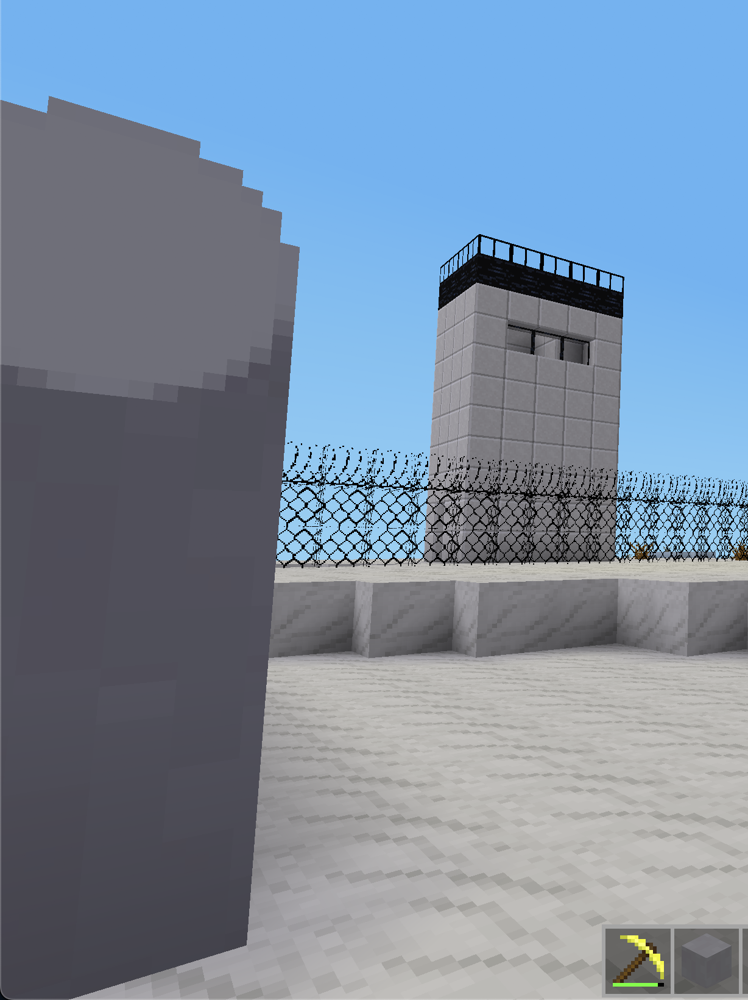

# Berlin Wall Mod for Luanti/Minetest (Art Project)

> **Note:** This mod is intended primarily as an **art project** to recreate historical architecture in Luanti/Minetest. It focuses on architectural accuracy of the Grenzmauer 75 design rather than gameplay mechanics.



This mod adds blocks representing parts of the Berlin Wall, specifically the **Grenzmauer 75** (Border Wall 75) generation.

## Blocks Included

| Block Name | Description | Light |
|------------|-------------|-------|
| `berlin_wall:search_light` | Search light block that emits light | Light level 10 |
| `berlin_wall:fence_site` | Fence block, typically used on tower tops | None |
| `berlin_wall:grenzmauer_top` | Top section with semi-circular concrete pipe (Grenzmauer 75 style) | None |
| `berlin_wall:wall_block` | Standard wall block (stone texture on all sides) | None |

## About Grenzmauer 75

The top of the Berlin Wall's final generation (Grenzmauer 75) was fitted with a smooth, semi-circular concrete pipe to eliminate any flat surface, thereby preventing climbers from gaining a foothold or securing ladders. The `grenzmauer_top` block represents this distinctive feature with different textures for the sides versus the front/back faces.

## Installation

1. Copy this folder into your Minetest/Luanti `mods` directory
2. Enable the mod in your world's `world.mt` file or through the game menu
3. Start or reload your world

## Requirements

- Luanti/Minetest (any recent version)

## Usage

Once enabled, the blocks will be available in the creative inventory under the "Berlin Wall" category, or you can place them using commands:

```
/give berlin_wall:search_light
/give berlin_wall:fence_site
/give berlin_wall:grenzmauer_top
/give berlin_wall:wall_block
```

## License

- **Code**: MIT License (see [LICENSE.md](LICENSE.md))
- **Graphics/Textures**: CC0 (Public Domain)

## Credits

- Textures provided by user
- Code generated with AI assistance

## Related Mods

- **Barbed Wire**: The specific barbed wire texture shown in the screenshot is from a separate mod by the same author.
